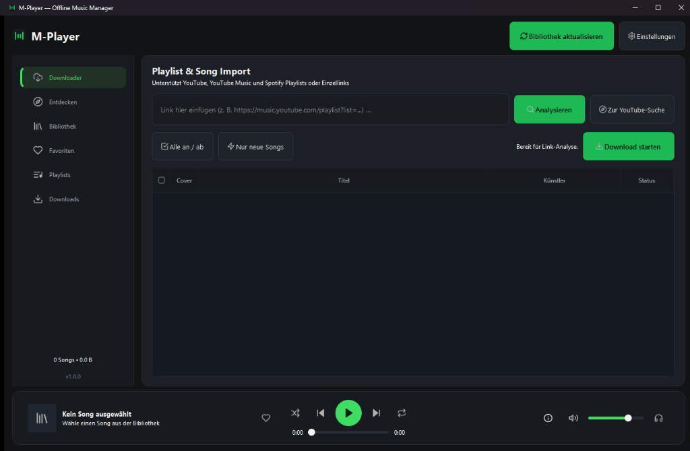

# 🎵 M-Player — Offline Music Manager & YouTube Downloader

Ein moderner, lokaler Windows-11-Musik-Manager mit eleganter PySide6-Oberfläche (Spotify-Dark-Theme), SQLite-Datenbank, integriertem YouTube-Downloader (`yt-dlp`), intelligenter Tag-Bereinigung und Duplicate-Finder.

<p align="center">
  
</p>

---

## ✨ Was M-Player kann (Features)

### 🎧 1. Lokale Musikverwaltung & Bibliothek
* **Listen- & Rasteransicht:** Schnelles Umschalten zwischen einer kompakten Tabellenansicht und visuellem Cover-Grid.
* **Filter-Chips & Schnellsuche:** Direktes Filtern nach *Favoriten*, *Zuletzt hinzugefügt*, *Nicht gehört*, sowie dynamische Dropdowns nach **Künstler**, **Jahr** und **Genre**.
* **Song-Details & Empfehlungen:** Klappbare Seitenleiste mit Cover, Bitrate, Spieldauer, Abspielzähler und ähnlichen Song-Empfehlungen.
* **Playlists:** Eigene Playlists erstellen, verwalten und Tracks per Klick oder Drag-and-Drop organisieren.

### 📥 2. YouTube- & Spotify-Import
* **Direkte In-App-Suche (Entdecken):** Songs, Alben oder Playlists direkt in der App auf YouTube suchen – ganz ohne Browser.
* **Direct Stream / Vorhören:** Songs vor dem Download direkt per Audio-Stream in der App anhören.
* **Batch-Downloader:** YouTube-, YouTube-Music- und Spotify-Links einfügen und als hochwertige MP3 (320 kbps) mit eingebetteten Covern herunterladen.
* **Fortschritt & Warteschlange:** Visuelle Download-Queue mit Pause-, Fortsetzen- und Abbrechen-Funktion.

### 🧠 3. Intelligente Metadaten & Organisation
* **Auto-Tag-Cleaning:** Entfernt automatisch störenden YouTube-Müll wie `[Official Video]`, `(HD)`, `Topic`, `VEVO`, `Lyrics` usw. aus Künstler- und Titelfeldern.
* **Automatische Album-Erkennung:** Erkennt beim Scannen oder Laden fehlende Albumnamen und Release-Jahre online über die **iTunes Search API** und **MusicBrainz**.
* **Duplikat-Finder:** Findet doppelt vorhandene Songs (z. B. Video vs. Audio-Upload) anhand von **Fuzzy-Matching** und Spieldauer-Toleranz (±2s) mit interaktivem Bereinigungs-Dialog.
* **Automatische Cover-Suche:** Sucht und bettet hochauflösende Album-Cover automatisch in die ID3v2.3-Tags ein.

### 🎛️ 4. Player & Mini-Player
* **Vollwertige Wiedergabe:** Play/Pause, Skip, Shuffle (Zufall), Repeat (Wiederholen), Lautstärkeregler und stufenloser Timeline-Direct-Seek.
* **Mini-Player (`Ctrl+M`):** Kompaktes Schwebefenster für die Bildschirmecke, ideal beim Arbeiten oder Zocken.
* **Mehrsprachig (Multi-Language):** Vollständige Unterstützung für **Deutsch 🇩🇪**, **English 🇬🇧** und **Magyar 🇭🇺** (in den Einstellungen umschaltbar).

---

## 🚀 Installation & Start

Es gibt zwei Möglichkeiten, M-Player zu nutzen:

### Option A: Portable Version (Empfohlen — Keine Installation nötig)
1. Die neueste Version unter [Releases](https://github.com/marka87/M-Player/releases) herunterladen (`M-Player-Portable-v1.0.0.zip`) und entpacken.
2. Doppelklick auf **`M-Player.exe`** – fertig!
> *Hinweis:* FFmpeg, ffprobe und alle benötigten Tools sind im `bin/`-Ordner bereits enthalten. Die App kann direkt vom **USB-Stick** an jedem beliebigen Windows-PC gestartet werden.

---

### Option B: Aus dem Quellcode ausführen (Entwickler)

#### 1. Voraussetzungen
* **Python 3.11** oder neuer ([python.org](https://www.python.org)) – beim Setup *Add Python to PATH* aktivieren.
* **FFmpeg** (empfohlen via WinGet):
  ```powershell
  winget install Gyan.FFmpeg
  ```
* **Deno** (für YouTube-Entschlüsselung):
  ```powershell
  winget install DenoLand.Deno
  ```

#### 2. Setup
Repository klonen und virtuelle Umgebung anlegen:
```powershell
git clone https://github.com/marka87/M-Player.git
cd M-Player

python -m venv .venv
.\.venv\Scripts\Activate.ps1
pip install -r requirements.txt
```

#### 3. App starten
```powershell
.\.venv\Scripts\python.exe main.py
```

*(Optional)* Für den Import von Spotify-Playlists können eigene Spotify-API-Keys in der Umgebung hinterlegt werden (`$env:SPOTIPY_CLIENT_ID = "..."` und `$env:SPOTIPY_CLIENT_SECRET = "..."`). YouTube funktioniert komplett ohne API-Keys.

---

## 📦 Eigene Portable-Version bauen

Möchtest du eine frische `.exe` und ein Standalone-ZIP-Archiv selbst erstellen? Führe einfach das automatisierte Build-Skript aus:

```powershell
.\.venv\Scripts\python.exe build_portable.py
```
Das Skript kompiliert die Anwendung mit PyInstaller, bündelt FFmpeg, Deno und alle Themes und erzeugt die fertige Distribution im Ordner `dist/`.

---

## ⌨️ Tastatur-Shortcuts

| Taste | Funktion |
| :--- | :--- |
| **Leertaste** | Play / Pause |
| **Enter** | Ausgewählten Song abspielen / Suche im Downloader & Entdecken starten |
| **Pfeil links / rechts** | 5 Sekunden vor- / zurückspulen |
| **Entf (Delete)** | Ausgewählten Song aus der Bibliothek löschen |
| **Ctrl + M** | Mini-Player umschalten |
| **Esc** | Song-Details-Seitenleiste schließen |

---

## 📁 Datenablage & Dateistruktur

* **Musikdateien:** Werden sauber nach dem Schema `Music/<Künstler>/<Album>/01 - Titel.mp3` abgelegt.
* **Datenbank:** `music_library.db` (SQLite) speichert Metadaten, Playlists, Play-Counts und Favoriten lokal.
